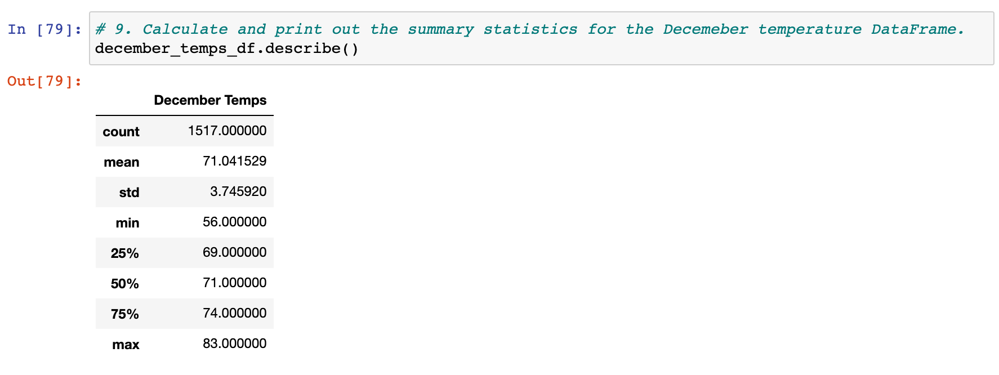

# SurfsUp Challenge:  Weather Trend Analysis using SQLAlchemy & Python

## Overview of the analysis: 
This analysis project was undertaken as part of analysis of weather patterns on the Island of Oahu, to inform potential investors about seasonal weather trends that may affect the level of business the planned surf & ice cream shop may experience. We began by using the provided weather dataset for Oahu- querying almost 20,000 datapoints from 9 weather stations across the island, over a period of almost 7 years, to find the temperature and precipitation ranges and ditributions. We then focused on 2 months of data: June and December and built queries to find the temperatures for these 2 months across the several years included in the dataset.

## Resources
Data source provided:  
* hawaii.sqlite Dataset

Software utilized: 

* Jupyter Notebook v. 6.0.3
* Visual Studio Code Version: 1.47.3

Python libraries used: 

* Pandas
* Numpy
* Datetime 
* SqlAlchemy

## Results: 
Our analysis shows the temperatures captured by the weather stations on Oahu for the months of June and December over the timespan included in the provided hawaii.sqlite dataset. The temperatures for these two months ranges from a low of 56 degrees to a high of 85 degrees, with averages in the lower half of the 70s with standard deviations in the 3.25 to 3.75 range. In general June is a warmer month than December, and has higher lows and higher high temparatures.

* Average temperatures in December is 71 degrees while June's average temperature is almost 75 degrees
* The low temperatures in December are 56 degrees, 8 degrees less than in June
* The high temperatures for June (85 degrees) are only 2 degrees higher than the high temperatures in December

We queried the 1700 data points observed, from 9 weather stations on Oahu for June months and 1517 data points for December. 

## Summary: 
Our data analysis shows that the temperature across Oahu in the months of June and December is mostly in the 70s and 80s, and while December has a lower absolute temperature- (minimum 56 degrees, compared to June's minimum of only 64), 75% of the days in December across the almost 7 years studied were above 69 degrees. June had 75% of days at or above 73 degrees and 25% of days at or above 77 degrees.

In order to provide a fuller picture of weather conditions that may impact our planned surf & ice cream shop's sales, we looked at the precipitation data available in the dataset and ran similar queries to those performed for temperature.  From these queries we generated statistical summary tables and we can see that there has been a marginally lower amount of rainfall in June than December (mean of 0.13 inches compared to 0.21 inches). Both months recorded almost no rain (0.03 inches or less) half of the time although there are maximim pecipation readings of 4.43 inches for June and 6.42 for December, indicating that large amounts of rain can occur in both months but occurs less than 25% of the time.

Looking at a distribution of the precipitation data for June as well as December, we can see that a majority of days had very little or no rain. There are, however some days with higher amounts of rain and a small amount of days with significant amounts of rain- and December has the higher rainfall in inches per day.

While more days have very little or no rain, a deeper dive shows that June had 5% of days with 0.71 inches of rain, 1% of days with 1.66 inches and 0.5% of days with more than 2 inches of rain.

Looking at December rainfall on Oahu, we see that more days had more rainfall than June, 5% of days had 1.15 inches and 1% of days had 2.76 inches.

